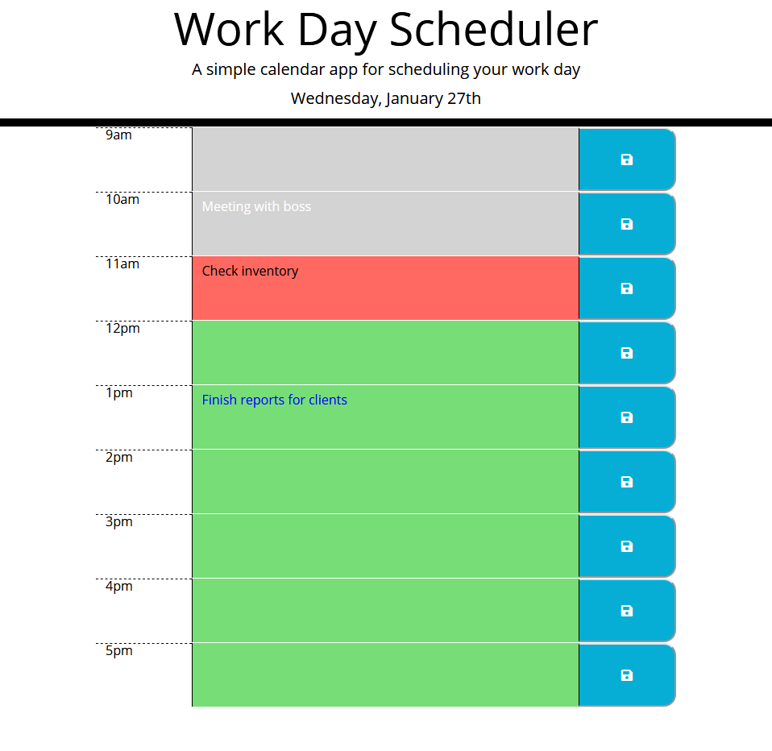

# Work_Day_Scheduler

## Code Description 
An HTML file with a simple structure was given that had links to different CDNs as well as a CSS file with different styles to be applied once more elements were implemented. While a small amount of code was added to the initial HTML in terms of static elements, JavaScript and jQuery were utilized to add dynamic color changing based on the time of day by using Moment.js, apply styles, and use local storage to have the items persist.

jQuery was used for the majority of the JavaScript code. Iterating loops and applying class styles were done with the jQuery methods. In order to properly apply the loops and use the local storage, DOM traversal through jQuery methods were used so that the HTML could remain fairly simple while allowing a small amount of code to be used in the JavaScript file as well.

## Function
The Work Day Scheduler displays the current date at the top of the page and lists the hours of a typical work day(9-5). The user can type their tasks into a text area for each hour to organize their schedule. When they have written all that they need for that hour, they can hit the save button to the right of the text area to allow the tasks to persist after refreshing the page.

The color of the text area is based on the current hour of the user.
 - Gray: Past hours
 - Red: Current hour
 - Green: Future hours

## Live Link
https://riraq.github.io/Work_Day_Scheduler/

## Screenshot
